# 如何模拟磁盘满
在日常开发过程中，可能会遇到磁盘空间不足导致程序运行异常的场景，用大文件填充磁盘是一种方法，但比较影响日常使用，构建一个小磁盘更容易触发。
## Windows
在Windows平台，有一些第三方工具，但个人更倾向于使用Windows平台的默认能力，创建小容量虚拟磁盘，而且方便进行自动化。
### 创建小容量虚拟磁盘
#### 图形界面操作
##### 1.打开磁盘管理
按Win + R输入diskmgmt.msc
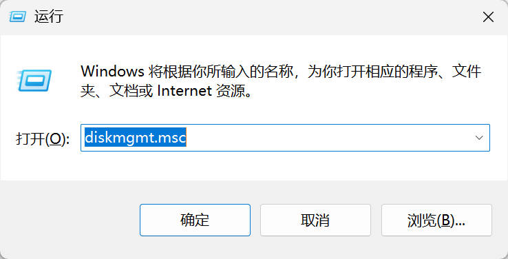
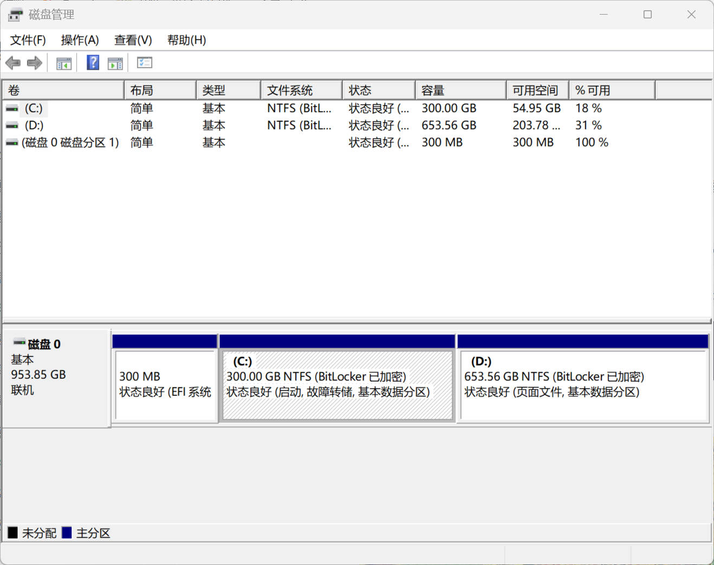
##### 2.创建或附加VHD
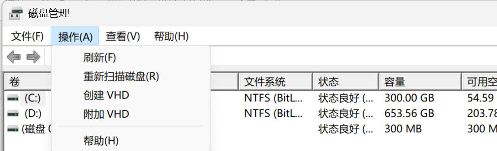
###### 2.1 创建VHD
"**操作**" -> "**创建VDH**"
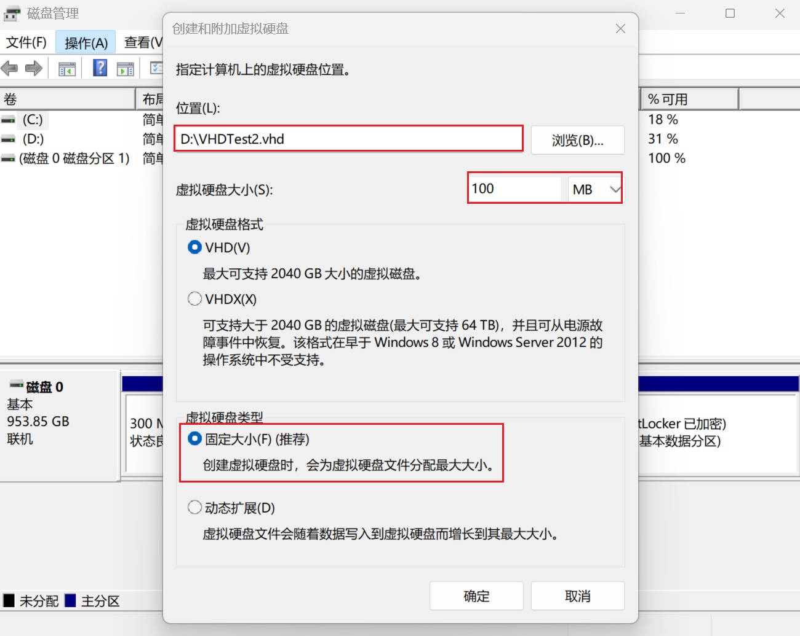
在磁盘上右击，选择**初始化磁盘**
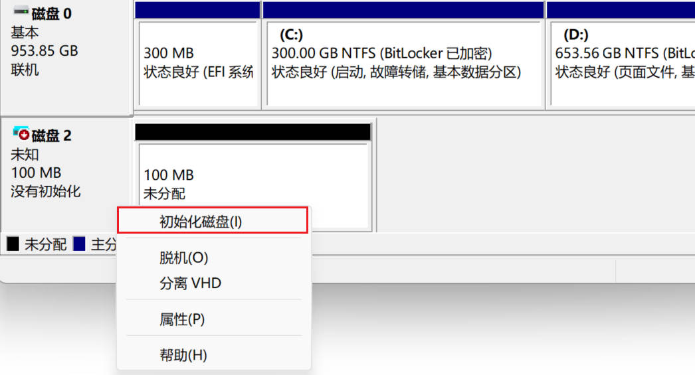
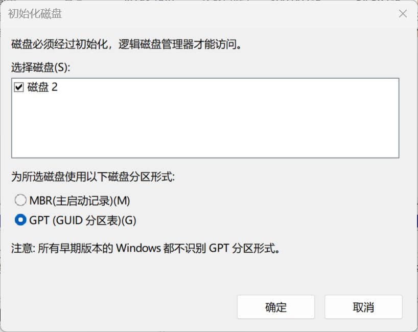
###### 2.2 附加VHD
"**操作**" -> "**附加VDH**"
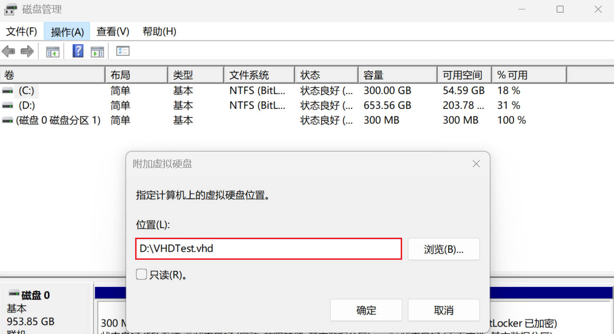
#### 3.新建简单卷
在未分配空间上右击，选择**新建简单卷**
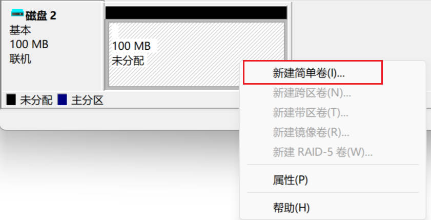
分配驱动器号
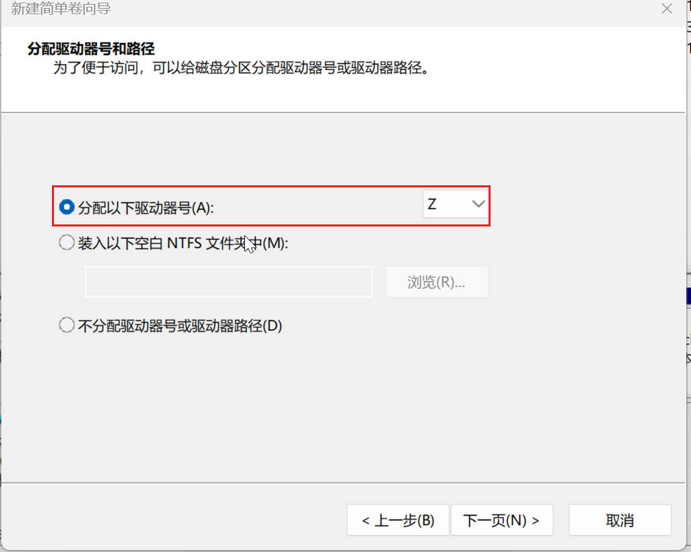
检查结果
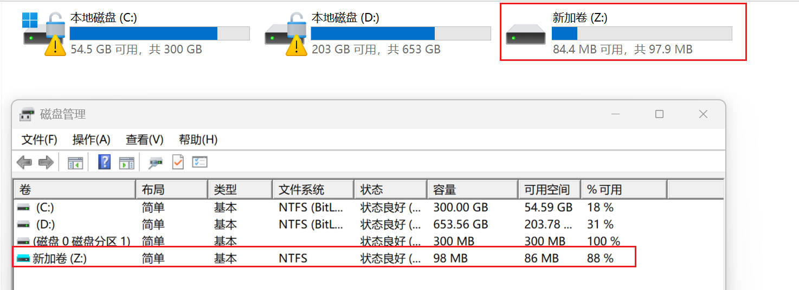
#### 4.删除卷
删除卷，也可忽略这一步直接执行**分离VHD**
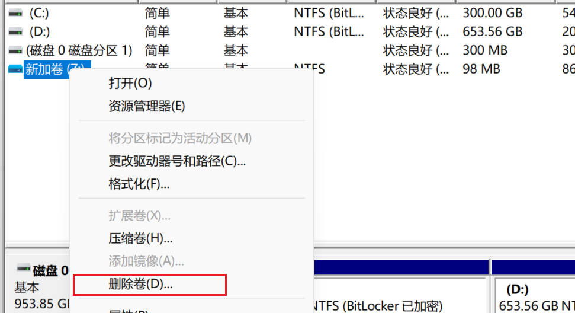
#### 5.分离VHD
在磁盘上右击，选择"**分离VHD**"
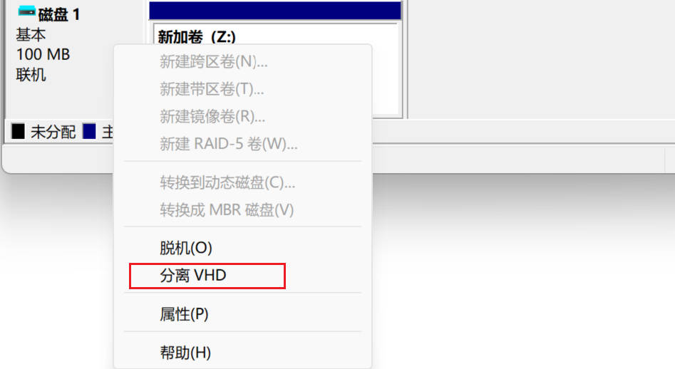
#### 命令行
## Linux